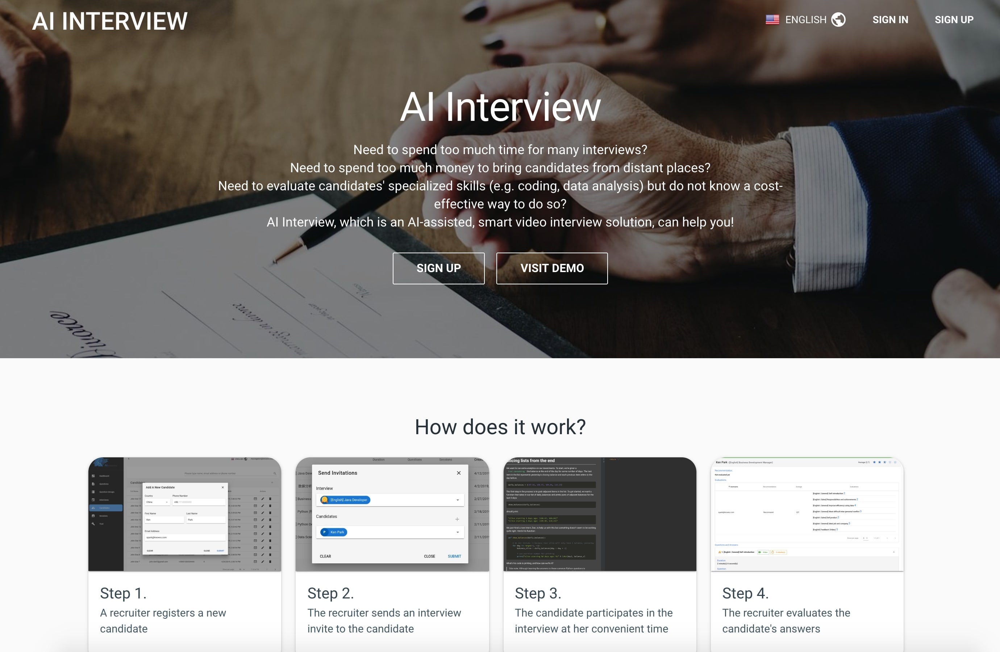

안녕하세요. 저는 장기현입니다. 저는 다음과 같은 일들을 할 수 있습니다:

- AWS DevOps
- Back-End Development
  - Flask, Django
- Front-End Development
  - Vue
- System Architect
  - AWS Sevice 구성
  - AWS Serverless 구성
  - Linux 시스템 구성

 

# Projects

 

## @Knowru (2017년 12월 - 2019년 11월)
---
### Online Video Call
- 웹 브라우저 상에서 WebRTC 를 이용한 실시간 화상통화 시스템 개발
- 개발 환경 : WebRTC, React, Flask, AWS

### Online Recruiting

- AWS API Gateway 와 Lambda 를 이용한 REST API 개발 (Cognito, RDS, API Gateway, Lambda, Cloudfront, S3)
- Vue 를 이용한 Frontend 개발
- 개발 환경 : Python, AWS, Vue, Sqlalchemy

### Digital Signage
- Raspberry pi headless wifi setup 시스템 개발
- AWS IoT 를 이용한 Raspberry pi 제어 시스템 개발 (IoT, S3, API Gateway, Lambda, Cognito, DynamoDB)
- 개발 환경 : Python, AWS, Raspberry pi, Redis

### People Counting
- AWS Rekognition 을 이용한 비디오 분석 및 Face Tracking 개발
- Yolo 를 이용한 Person Detecting 및 People Counting 개발
- Automated Video processing system 구성(S3, Lambda, ECS, SQS, SNS, Elastic Transcoder, Rekognition)
- 개발 환경 : Python, AWS, OpenCV, Yolo v2

 

## @ninestairs (2016년 8월 - 2017년 11월)
---
### 영단어 추천 API 서버
- 영어 기출 문제를 분석하여 해당 시험에 나올 수 있는 단어를 추천
- 서버 과부하 및 에러 대응을 위한 AutoScaling, Load Balancing(ELB) 구성
- 개발 환경 : Python, Django Rest Framework, NLTK(Natural Language Toolkit), MariaDB, AWS

 

## @LG전자 (2005년 1월 - 2015년 3월)
---
### 테스트 자동화 시스템
- 스마트폰의 품질검증을 위한 테스트 케이스를 자동으로 실행하여 테스트 결과를 리포트
- Test Contents 수행 Agent 개발
- 이슈관리시스템 연동 모듈 개발
- 스마트폰, 서버간 인터페이스 설계 및 개발
- 개발 환경 : Linux, JIRA, Eclipse, Tomcat, MySQL, Java

### 스마트폰 Lockup Detector
- 스마트폰의 시스템 Lockup Detecting 툴 개발
- 개발 환경 : JIRA, Python, Eclipse, QPST(시스템 칩셋 제어 도구)

### 정적분석 자동화 시스템
- 정적분석 시스템을 Git과 연계하여 소스 코드의 정적분석을 자동화
- 정적분석 이슈 리포팅툴 개발
- 소스 코드 빌드와 정적분석 자동화
- 소스 코드 Visualization 시스템 구축
- 개발 환경 : TD(Test Director), Eclipse, Klocwork, Ruby, Jenkins, SonarQube, MySQL

### 코드 품질 향상
- 정적분석툴을 이용한 소스 코드 분석과 수정 가이드
- Code Metric에 기반한 잠재적인 위험성 있는 모듈의 Refactoring 가이드
- 분석환경: Klocwork(Java), Coverity-Prevent(C/C++)

### MMS(Multimedia Messaging Service)
- MMS framework(obigo, infineon) 포팅
- 해외 사업자 망에서의 안정성 확보를 위해 개발 및 테스트를 위한 출장
- 개발 환경 : Source Insight, T32(Trace32), C

 
